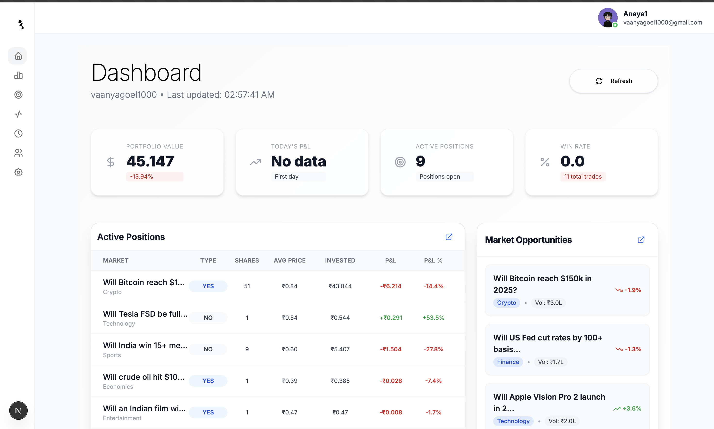

# Augur - Real-Time Prediction Market Platform

<div align="center">


**A sophisticated real-time prediction market platform enabling users to trade on future outcomes across multiple domains.**


</div>

---

## Table of Contents

- [Overview](#-overview)
- [Key Features](#-key-features)
- [Technology Stack](#-technology-stack)
- [Architecture](#-architecture)
- [Installation](#-installation)
- [Usage](#-usage)
- [Screenshots](#-screenshots)
- [Contributors](#-contributors)
- [License](#-license)

---

## Overview

**Augur** is a comprehensive prediction market platform that enables users to trade on binary outcomes (YES/NO) across multiple domains including sports, politics, technology, economics, and cryptocurrency. The platform combines advanced financial modeling, real-time data synchronization, and an intuitive user experience.

### Objective

To develop a **scalable, secure, and efficient** prediction market platform that facilitates binary outcome trading with real-time market updates and comprehensive portfolio management capabilities.

### Key Achievements

- **Sub-second latency** for market updates
- **99.9% accuracy** in order matching
- **Robust portfolio analytics** with real-time P&L calculations
- **Concurrent user support** with efficient resource utilization
- **Data consistency** through atomic database transactions

---

## ✨ Key Features

- **Real-time Market Updates** - Live market data synchronization using Server-Sent Events
- **Advanced Order Matching** - Sophisticated price-time priority matching engine
- **Portfolio Management** - Comprehensive tracking with P&L calculations and analytics
- **Market Depth Visualization** - Interactive orderbook with real-time updates
- **Secure Authentication** - JWT-based authentication via Supabase
- **Responsive Design** - Optimized for both desktop and mobile devices
- **Intuitive UI/UX** - Modern, clean interface built with TailwindCSS
- **Performance Optimized** - Server-side rendering and strategic caching

---

## Technology Stack

### Frontend Layer (Presentation Tier)

| Technology | Purpose |
|------------|---------|
| **Next.js 15** | Framework with App Router for optimized SSR |
| **TypeScript** | Type safety and enhanced developer experience |
| **TailwindCSS** | Utility-first CSS framework with custom components |
| **React Context API** | State management with custom hooks |
| **EventSource API** | Server-Sent Events consumption for real-time updates |

### Backend Layer (Application Tier)

| Technology | Purpose |
|------------|---------|
| **Next.js API Routes** | RESTful API with serverless functions |
| **Supabase Auth** | Authentication with JWT token management |
| **Custom SSE Implementation** | Real-time engine with PostgreSQL NOTIFY/LISTEN |
| **Trading Engine** | Order matching with atomic transaction guarantees |
| **Middleware** | Rate limiting, authentication, and error handling |

### Database Layer (Data Tier)

| Technology | Purpose |
|------------|---------|
| **PostgreSQL (Supabase)** | Primary database with Row Level Security |
| **In-Memory Caching** | Strategic caching for frequently accessed data |
| **PostgreSQL Triggers** | Real-time data propagation |
| **Automated Backups** | Point-in-time recovery strategy |

---

## Architecture

The platform follows a **three-tier architecture**:

```
┌─────────────────────────────────────────┐
│   Frontend Layer (Presentation Tier)    │
│   • Next.js 15 + TypeScript            │
│   • React Context API                  │
│   • TailwindCSS Components             │
└─────────────────────────────────────────┘
                    ↕
┌─────────────────────────────────────────┐
│   Backend Layer (Application Tier)      │
│   • Next.js API Routes                 │
│   • Trading Engine                      │
│   • Real-time SSE Engine               │
│   • Authentication & Middleware        │
└─────────────────────────────────────────┘
                    ↕
┌─────────────────────────────────────────┐
│   Database Layer (Data Tier)           │
│   • PostgreSQL (Supabase)               │
│   • Row Level Security                  │
│   • Real-time Triggers                  │
│   • Caching Layer                      │
└─────────────────────────────────────────┘
```

### Methodology

The system was developed using modern web technologies:

- **Frontend**: Next.js 15 with TypeScript for type-safe, performant UI
- **Backend**: Next.js API routes with custom trading engine
- **Real-time Communication**: Server-Sent Events (SSE) with PostgreSQL NOTIFY/LISTEN
- **Data Persistence**: PostgreSQL via Supabase with advanced security policies

---

## Installation

### Prerequisites

- **Node.js** 18+ and npm/yarn
- **PostgreSQL** database (or Supabase account)
- **Git** for version control

### Setup Steps

1. **Clone the repository**
   ```bash
   git clone https://github.com/codebanditssss/YesNoMaybe.git
   cd yesnomaybe
   ```

2. **Install dependencies**
   ```bash
   npm install
   # or
   yarn install
   ```

3. **Configure environment variables**
   ```bash
   cp .env.example .env.local
   ```
   
   Update `.env.local` with your configuration:
   ```env
   NEXT_PUBLIC_SUPABASE_URL=your_supabase_url
   NEXT_PUBLIC_SUPABASE_ANON_KEY=your_supabase_anon_key
   SUPABASE_SERVICE_ROLE_KEY=your_service_role_key
   DATABASE_URL=your_database_url
   ```

4. **Run database migrations**
   ```bash
   npm run migrate
   ```

5. **Start the development server**
   ```bash
   npm run dev
   ```

6. **Open your browser**
   ```
   http://localhost:3000
   ```

---

## Usage

### Development

```bash
# Start development server
npm run dev

# Build for production
npm run build

# Start production server
npm start

# Run tests
npm test

# Run linting
npm run lint
```

### Key Commands

| Command | Description |
|---------|-------------|
| `npm run dev` | Start development server with hot reload |
| `npm run build` | Build optimized production bundle |
| `npm run lint` | Run ESLint for code quality |
| `npm test` | Run Jest test suite |
| `npm run type-check` | TypeScript type checking |

---

### Dashboard View



*Comprehensive dashboard showing portfolio analytics, active positions, and market opportunities*

---

## Contributors


**Developed by**

### Khushi Diwan & Vaanya Goel

---


## Significance

This project contributes to the **financial technology sector** 


